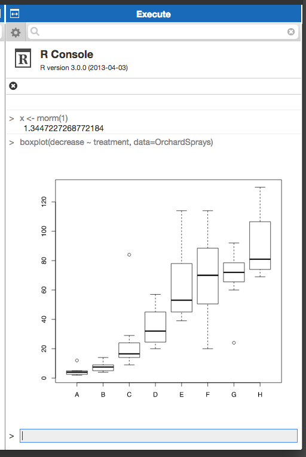

R Console for Labwiki
=====================

A plugin for an interactive R session within Labwiki

## Installation

Follow the instruction in the Labwiki README file on how to install
and configure plugins.

## Try it

